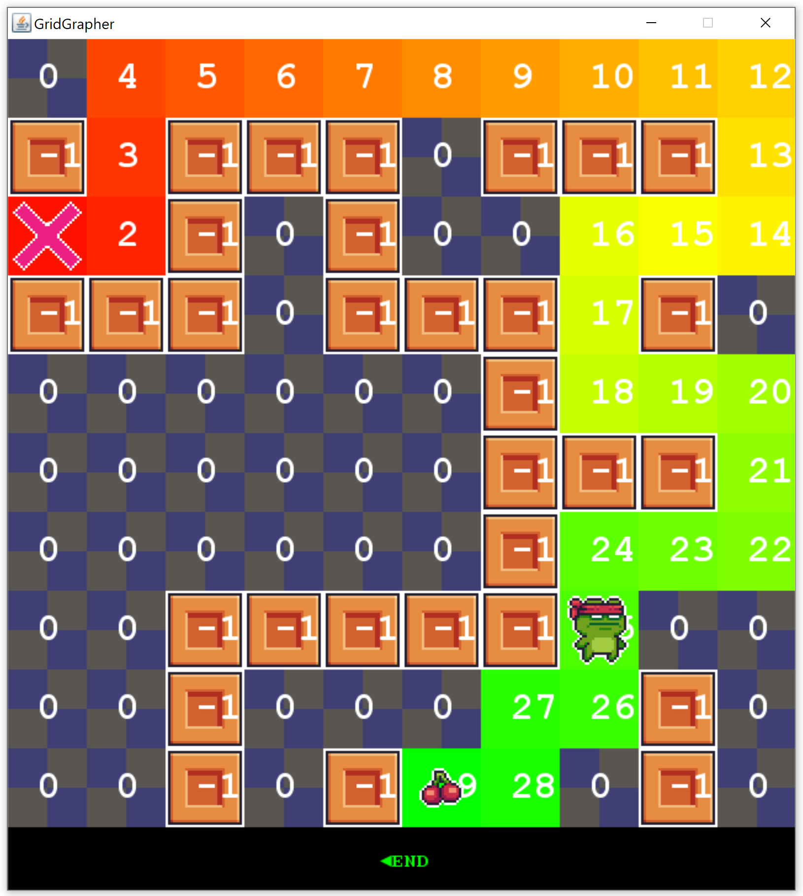

# IA Grid Grapher

Estas son unas clases que se pueden utilizar para simular todas las soluciones del problema del tipo laberintos, basados en Reglas.

Existen los siguientes ejemplos:

* Laberinto
* Torre
* Alfil
* Reina

	

